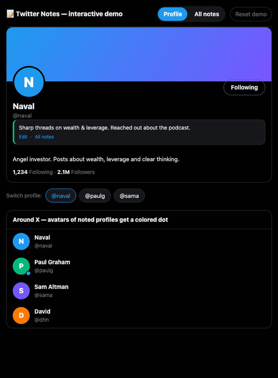

# Twitter Notes — private notes on X profiles

🧩 Chrome extension (Manifest V3) that lets you add **private notes to profiles
on X.com (Twitter)**. Data is stored locally only (`chrome.storage.local`) — there is no
server, no login, and the notes are visible only to you.

## Features ✨

- 📝 An "Add note" panel injected under the profile name on X.
- 🔁 The note shows up automatically when you return to a profile.
- 👀 A small colored dot marks the avatar of any noted profile across X; the note shows in X's native hover card.
- 🏷️ Colored profile labels (e.g. red = warning, green = OK) visible right on X.
- 🗂️ A dedicated page with all your notes: search, filter by color, edit, delete.
- 💾 Export / import all notes to a JSON file (backup).
- 🌐 Works on `x.com` and `twitter.com`.

## Demo 🎬



Try the UI **without installing the extension or logging in to X**. A standalone page mounts the
_real_ note panel on a mock X profile and runs the _real_ "all notes" page, backed by
`localStorage` instead of `chrome.storage`:

```bash
npm install
npm run demo        # opens http://localhost:5174
```

Add a note, switch between the sample profiles and come back (the note reappears), pick a colored
label, then open the **All notes** tab — search, edit, delete and export/import all work. Use
**Reset demo** to clear the sample data. Build a static version with `npm run demo:build`
(outputs to `demo-dist/`).

## Requirements 📋

- Node.js 24 LTS (`node -v`)
- Chrome / Brave / Edge / Arc (Chromium engine)

## Install (developer mode) 🚀

```bash
npm install
npm run build      # one-off build into the dist/ folder
# or:
npm run dev        # developer mode with HMR (CRXJS)
```

Then:

1. Open `chrome://extensions`.
2. Enable **Developer mode** (top-right corner).
3. Click **Load unpacked** and select the **`dist/`** folder.
4. Open any profile on `x.com` — the note panel appears under the name.

Open the page with all notes by clicking the extension icon in the toolbar
(or the "All notes" button in the panel).

## Notes ⚠️

> [!WARNING]
> Notes live only in your browser — uninstalling the extension deletes them. Back them up
> regularly with **Export JSON** on the "All notes" page.

- A note is tied to the **profile name (@handle)**. If someone changes their `@handle`,
  the note stays under the old name (a rare case; you can move it manually). The
  `schemaVersion` field in the data leaves room for later keying by an immutable ID.
- X may change its page structure; we anchor on `data-testid` attributes, which are the
  most stable. If it breaks, the panel simply won't show — your notes are still available
  on the "All notes" page.

## Privacy Policy 🔒

The extension stores everything locally in your browser and sends nothing anywhere — no
servers, no analytics, no third parties. See [privacy-policy.md](privacy-policy.md) for the
full statement.

## License 📄

[The MIT License](https://piecioshka.mit-license.org) @ 2026
